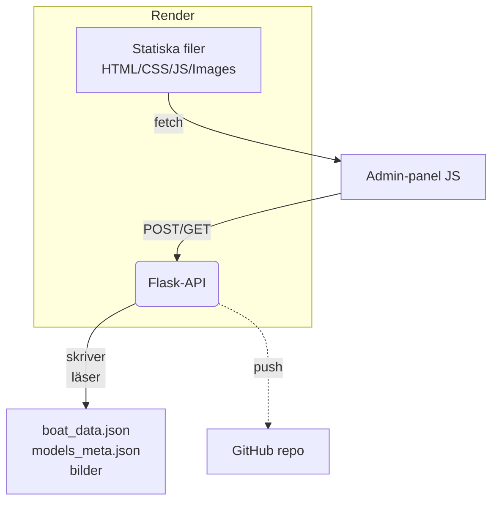

# Henricssons Kapell & Marintextil – Webbsida & Admin-API

Detta repo innehåller både den statiska webbsidan **henricssons.se** och ett litet Flask-API som gör det möjligt att uppdatera innehåll (båtmodeller, bilder, texter m.m.) direkt via ett administratörsgränssnitt. Syftet med README:n är att en ny utvecklare snabbt ska förstå hur allt hänger ihop – lokalt och i produktion (Render).

> TL;DR
> 1. Webbsidan körs som **Static Site** på Render.<br/>
> 2. API-t körs som **Web Service** på Render.<br/>
> 3. Ändringar som görs i adminpanelen sparas till disk **och** pushas automatiskt till GitHub ➔ överlever om-deploys.

---

## Innehållsförteckning
1. [Arkitektur](#arkitektur)
2. [Mappstruktur](#mappstruktur)
3. [Admin-panelen](#admin-panelen)
4. [API-t (Flask)](#api-t-flask)
5. [Deploy på Render](#deploy-på-render)
6. [Köra lokalt](#köra-lokalt)
7. [Miljövariabler](#miljövariabler)
8. [Vanliga fel & felsökning](#vanliga-fel--felsökning)
9. [Contributing](#contributing)

---

## Arkitektur

1. **Static Site** (HTML/CSS/JS) laddas direkt av besökare.
2. **Admin-panelen** (\`admin.html\` + \`admin.js\`) anropar Flask-API:t för att läsa & spara data.
3. **Flask-API** skriver JSON-filer och uppladdade bilder till disk **och** committar/pushar dessa filer tillbaka till GitHub med en PAT-token.
4. Nästa gång Render auto-deployar finns ändringarna redan i källkoden.

## Mappstruktur
```
Henricssons/
├── admin_api_flask.py      # Flask-API (Web Service)
├── admin.html              # Admin-GUI
├── admin.js                # JS-logik för admin
├── *.html / *.js / *.css   # Publika sidor
├── boat_data.json          # Genererad datafil (båtvarianter)
├── henricssons_bilder/     # Alla produkt-/galleribilder
└── requirements.txt        # Python-beroenden (API-t)
```
Viktigt att **henricssons_bilder/** och JSON-filerna ligger i repo:t – annars kan de inte pushas tillbaka.

## Admin-panelen
• Öppna **/admin.html** på den publika siten.<br/>
• Sidan laddar \`boat_data.json\` och \`models_meta.json\`.
• För varje fält (text, select, checkbox) finns **autosave**: `change`/`blur` triggar en POST till API:t. Efter 1 s läses ny data in så att det som sparats syns direkt.
• Bilder kan laddas upp via drag-and-drop eller filväljare ➔ skickas till `/api/upload_image`.

## API-t (Flask)
Fil: `admin_api_flask.py`

| Route | Metod | Beskrivning |
|-------|-------|-------------|
| `/boat_data.json` | GET | Servar nuvarande datafil |
| `/henricssons_bilder/<path>` | GET | Servar in-repo-bilder |
| `/api/save_boatdata` | POST | Tar emot JSON-payload med båtdata & sparar |
| `/api/save_models_meta` | POST | Tar emot metadata om modeller |
| `/api/upload_image` | POST | Tar emot `multipart/form-data` med bilduppladdning |

Alla routes har **CORS \*\*** (GET/POST/OPTIONS) så admin-sidan kan anropa dom var den än hostas.

### GitHub auto-commit
När någon sparar kör Flask-koden:
1. Skriver filen lokalt (Render-disk är skrivbar under deployment).
2. `git add ... && git commit -m "auto: update via admin" && git push` med hjälp av en **Personal Access Token** (miljövariabel `GITHUB_PAT`).

> Tips: PAT behöver endast \`repo\` scope och bör skapas från en bot-/service-användare.

## Deploy på Render
Vi har **två** tjänster kopplade till samma GitHub-repo:

1. **Static Site**
   - Build command: *(tom)*
   - Publish directory: **root**
   - Branch: `main`
2. **Web Service** (API)
   - Environment → Runtime: Python 3.11 (eller senast LTS)
   - Start command: `gunicorn admin_api_flask:app`
   - Build command: *(Render installerar automatiskt från requirements.txt)*
   - Environment Variables: se nedan

Se till att **Auto-Deploy** är aktiverat för bägge. Static Site kan vara *free plan*, medan Web Service kräver *Starter* för att hantera build-minuter; går att skala till 0 när den är idle.

## Köra lokalt
1. Klona repo:t.
2. Installera Python-beroenden:
   ```bash
   pip install -r requirements.txt
   ```
3. Starta API-t:
   ```bash
   # utvecklingsläge
   export FLASK_ENV=development  # Windows: set FLASK_ENV=development
   python admin_api_flask.py
   # eller
   gunicorn admin_api_flask:app
   ```
   API:n lyssnar på http://localhost:5000.
4. Serva statiska filer – enklast via VS Code Live Server eller:
   ```bash
   npx serve .
   ```
5. Öppna `http://localhost:3000/admin.html` (eller vart din statiska server kör) ➔ ändra ➔ se konsollen för POST-requests.

> Lokalt använder `admin.js` automatiskt `http://localhost:5000` som `API_BASE` om `window.location.hostname` är `localhost`.

## Miljövariabler
| Namn | Tjänst | Beskrivning |
|------|--------|-------------|
| `GITHUB_PAT` | Web Service | Personal Access Token för auto-commit/push |
| `GITHUB_REPO` | Web Service | `<owner>/<repo>` tex `username/henricssons` |
| `FLASK_ENV` | (valfritt) | `production` eller `development` |

Sätt dessa i Rend­­ers **Environment**-flik för Web Service.

## Vanliga fel & felsökning
| Problem | Kontrollera |
|---------|-------------|
| `503`/`CORS` fel när admin laddar data | 1. Är API-t vaken? (free plan idlar) <br/>2. Via Render-dashboard ➔ Logs |
| Ändringar sparas men försvinner vid ny deploy | Stämmer `GITHUB_PAT` & `GITHUB_REPO`? Push-en kan ha misslyckats |
| Bilder visas inte | Kolla att URL:en innehåller **/henricssons_bilder/** exakt en gång |

## Contributing
1. Skapa branch, push & öppna PR.<br/>
2. Kodformat: håll JS ES6, Python PEP8.<br/>
3. Efter merge auto-deployar Render.

---
© Henricssons Kapell & Marintextil. Detta repo är privat; dela ej PAT eller kunddata offentligt. 