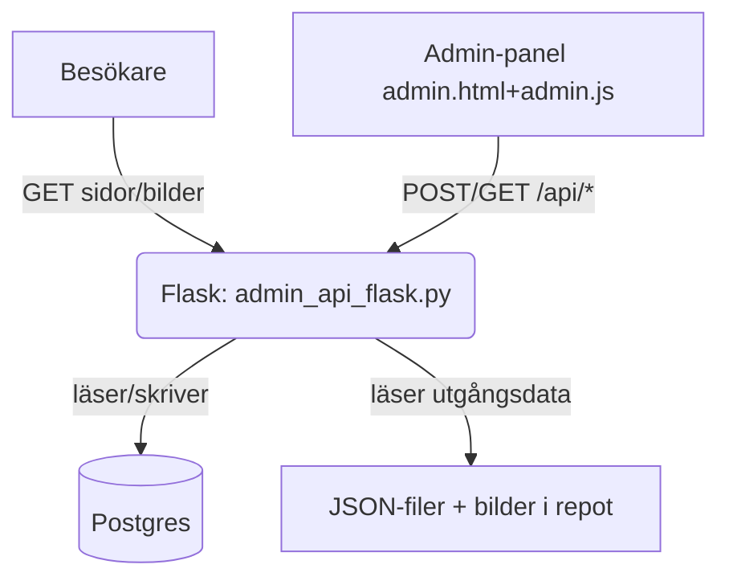

# Henricssons Båtkapell – Webbsida & Admin-API

Detta repo innehåller den publika webbsidan **henricssonsbatkapell.se** och ett Flask-API som gör det möjligt att uppdatera innehåll (båtmodeller, bilder, texter m.m.) direkt via ett administratörsgränssnitt.

> TL;DR
> 1. **En** Flask-tjänst på Render (`admin_api_flask.py`) servar både statiska sidor och API.
> 2. Innehåll som sparas via adminpanelen lagras i **Postgres** (`site_content`, `site_images` m.fl. tabeller) och överlever därför om-deploys. Filerna i repot fungerar som utgångsdata som DB-innehållet mergas ovanpå.
> 3. Render deployar automatiskt vid push till `main` (blueprint i `render.yaml`).

## Arkitektur


```mermaid
flowchart TD
    A[Besökare] -->|GET sidor/bilder| C(Flask: admin_api_flask.py)
    B[Admin-panel admin.html+admin.js] -->|POST/GET /api/*| C
    C -->|läser/skriver| D[(Postgres)]
    C -->|läser utgångsdata| E[JSON-filer + bilder i repot]
```

- Publika sidor: statiska HTML-filer i repo-roten, servade extensionslöst (`/om-oss` → `om-oss.html`).
- `/exempel/<slug>`, `/dynsatser/<slug>`, `/tillfalliga-produkter/<slug>`, `/search`, `/sitemap.xml` renderas server-side för SEO. Gamla URL:er från förra sajten 301:as via `LEGACY_EXAMPLE_REDIRECTS`.
- Den statiska catch-all-routen har en allowlist (`PUBLIC_STATIC_EXTENSIONS`) – källkod, dotfiler och interna JSON-filer servas inte.

## Datalagring

| Innehåll | Fil (utgångsdata) | Databas (vinner/mergas) |
|---|---|---|
| Båtdata | `boat_data.json` | `site_content['boat_data']` |
| Exempel/galleri | `examples_meta.json`, `henricssons_bilder/models_meta.json` | `site_content['examples_meta'/'models_meta']` |
| Sidtexter/banner | `page_texts.json` | `site_content['page_texts']` |
| Adminuppladdade bilder | disk (försvinner vid deploy) | `site_images` (fallback vid servering) |
| Formulärinskick + bilagor | – | `form_submissions`, `submission_attachments` |
| Tillfälliga produkter & varumärken | – | `temp_products`, `boat_brands` (+ bildtabeller) |

## Admin-panelen

- Öppna `/admin` på sajten → lösenordsinloggning (`ADMIN_PANEL_PASSWORD`), sessionscookie.
- API-anrop kan även autentiseras med headern `X-Admin-Key: <ADMIN_API_KEY>`.
- Formulärinskick hanteras under fliken Inskick; mailnotiser + kundbekräftelser går via Mailgun.

## Deploy på Render

En web service + Postgres, definierat i `render.yaml`. Auto-deploy vid push till `main`. Hälsokontroll: `/healthz`.

## Köra lokalt

```bash
pip install -r requirements.txt
python admin_api_flask.py   # lyssnar på http://localhost:25565
```

`.env` i repo-roten läses in automatiskt (utan att skriva över redan satta miljövariabler). Utan `DATABASE_URL` används lokal SQLite. Sätt tomma `MAILGUN_*` om du inte vill skicka riktiga mail vid test.

## Miljövariabler

| Namn | Beskrivning |
|---|---|
| `DATABASE_URL` | Postgres (sätts av Render), annars SQLite lokalt |
| `DATABASE_ANALYTICS_ENABLED` | `0` som standard; databasbaserad sidvisningsloggning hålls avstängd för att Neon ska kunna skala till noll |
| `ADMIN_PANEL_PASSWORD` | Lösenord för admin-inloggning |
| `ADMIN_API_KEY` | Nyckel för API-anrop (`X-Admin-Key`) |
| `MAILGUN_DOMAIN/API_KEY/FROM/TO` | Mailnotiser för formulär |
| `PUBLIC_BASE_URL` | Kanonisk bas-URL (`https://www.henricssonsbatkapell.se`) |
| `ALLOWED_ORIGINS` | CORS-origins |
| `OPENAI_API_KEY` m.fl. | AI-assistent i admin (valfritt) |
| `enable_chatbot` | `1` aktiverar publik chatt-widget (annars avstängd) |

## Vanliga fel & felsökning

| Problem | Kontrollera |
|---|---|
| Admin-ändringar syns inte | Render-loggar; DB-anslutning (`Database connected.` vid start) |
| Bilder 404:ar efter deploy | Uppladdade bilder ska servas ur `site_images` – kolla att uppladdningen gjordes efter att DB-fallbacken infördes |
| Mail kommer inte fram | `POST /api/mailgun_test` med admin-nyckel; kolla Mailgun-loggar |
